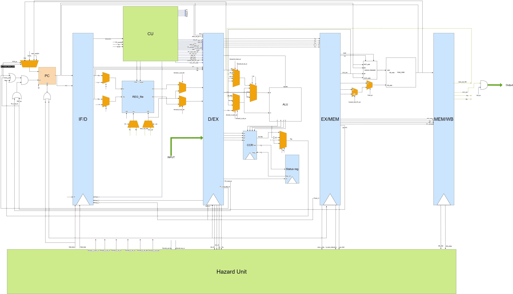

# 8-Bit Pipelined Processor – ELC3030 Project

## Overview
This project implements a **simple 8-bit pipelined processor** using **Verilog HDL**, designed as part of the *Advanced Processor Architecture (ELC 3030)* course at the Faculty of Engineering, Cairo University.

The processor follows a **RISC-like Instruction Set Architecture (ISA)** and supports **five pipeline stages** with hazard detection and data forwarding.  
The complete design flow and verification steps are documented in the accompanying **design report**, while functional requirements follow the **project specification document**.

---

## Project Objectives
- Design and implement an **8-bit pipelined processor**
- Support **Von Neumann architecture**
- Apply **FSM-based control logic**
- Implement **data forwarding and hazard handling**
- Verify correctness using **directed testbenches and waveform analysis**

---

## Processor Specifications
- **Architecture:** 5-stage pipelined RISC processor  
- **Data Width:** 8 bits  
- **Registers:**
  - 4 General Purpose Registers (R0–R3)
  - R3 functions as a Stack Pointer (SP), initialized to 255
- **Memory:**
  - 256 bytes, byte-addressable
  - Von Neumann architecture (shared instruction and data memory)
- **Reset:** Asynchronous, active-high
- **Interrupt:** Non-maskable external interrupt

---

## Pipeline Stages
The processor consists of the following pipeline stages:

1. **Instruction Fetch (IF)**
   - Fetches the instruction from memory using the Program Counter (PC)

2. **Instruction Decode (ID)**
   - Decodes the instruction and reads operands from the register file

3. **Execute (EX)**
   - Performs ALU operations and evaluates branch conditions

4. **Memory Access (MEM)**
   - Handles load/store instructions and stack operations

5. **Write Back (WB)**
   - Writes execution results back to the register file

Each stage is implemented as a separate Verilog module.

---

## Instruction Set Architecture (ISA)
The processor supports multiple instruction formats, including:

- **Arithmetic & Logical Operations**
  - ADD, SUB, AND, OR, NOT, INC, DEC
- **Data Transfer**
  - MOV, LDM, LDD, STD, LDI, STI
- **Control Flow**
  - JMP, JZ, JN, JC, JV, LOOP
- **Stack Operations**
  - PUSH, POP, CALL, RET, RTI
- **Input/Output**
  - IN, OUT

Instruction encoding and behavior are defined in the project specification.

---

## Hazard Detection and Data Forwarding
To ensure correct pipelined execution, the design includes a **Hazard Detection and Handling Unit**.

### Supported Hazards
- Data hazards
- Structural hazards
- Load-use hazards

### Techniques Used
- Memory → Execute forwarding
- Write Back → Execute forwarding
- Write Back → Decode forwarding
- Pipeline stalling when forwarding is not sufficient

---

## Verification and Testing
- Each major module has an independent **testbench**
- Directed test cases verify:
  - Functional correctness
  - Reset behavior
  - Pipeline flow
  - Hazard handling
- Simulation waveforms are analyzed to confirm correct operation

All verification steps and results are documented in the design report.

---

## Synthesis
The design was synthesized and analyzed for:
- Logic utilization
- Timing constraints
- Maximum operating frequency
- Post-synthesis schematic

Synthesis results are included in the project report.

---
